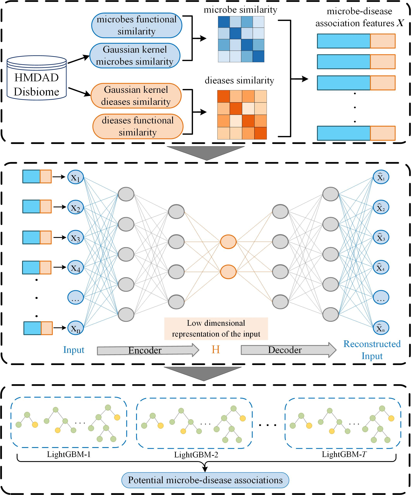

# SAELGMDA: Identifying human microbedisease associations based on sparse autoencoder and LightGBM

SAELGMDA is a tool to identify human microbe-disease associations using sparse autoencoder and LightGBM.



## Data

Data is available at [HMDAD](http://www.cuilab.cn/hmdad) and [Disbiome](https://disbiome.ugent.be/)

## Input file

- disease_features.txt: The expression matrix of functional similarity of diseases, row i and column j represent the similarity between disease i and disease j.
- microbe_features.txt: The expression matrix of functional similarity of microbe, row i and column j represent the similarity between microbe i and microbe j.
- adj.txt: The file has three columns of data. The first column is the id of the disease, the second column is the id of the microbe, and the third column indicates whether the two are associated (1 means the two are associated, 0 means the two are not associated).
- diseases.xlsx: The file has two columns of data, the first column is the id of the disease, and the second column is the name of the disease.
- microbes.xlsx: The file has two columns of data, the first column is the id of the microbe, and the second column is the name of the microbe.
  
  When you want to run your own data, you have to replace the above files.

## System Requirements

Install python3 for running this code. And these packages should be satisfied:

- numpy~=1.19.5
- argparse~=1.4.0
- tensorflow~=2.6.2
- tensorflow-gpu~=1.15.0
- keras~=2.3.0
- lightgbm~=3.3.5
- xlsxwriter~=3.0.9
- sklearn~=0.0
- scikit-learn~=0.24.2
- pandas~=1.1.5
- scipy~=1.5.4

## Download and configure

```python
git clone https://github.com/plhhnu/SAELGMDA
cd SAELGMDA
pip install -r requirements.txt
```

## Run in HMDAD or Disbiome

To run the model, default 5 fold cross validation

```
arguments:
  --cvs: Three kinds of cross validation.
  --dataset_name: The database name of this experiment.

example:
  Run cv3 in the HMDAD database:
    python main.py --cvs 3 --dataset_name "HMDAD"
  Run cv2 in the Disbiome database:
    python main.py --cvs 2 --dataset_name "Disbiome"
```
